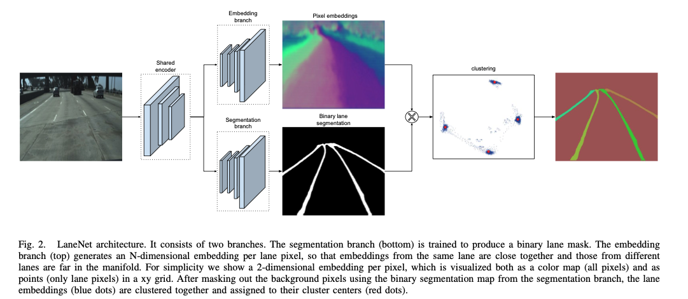
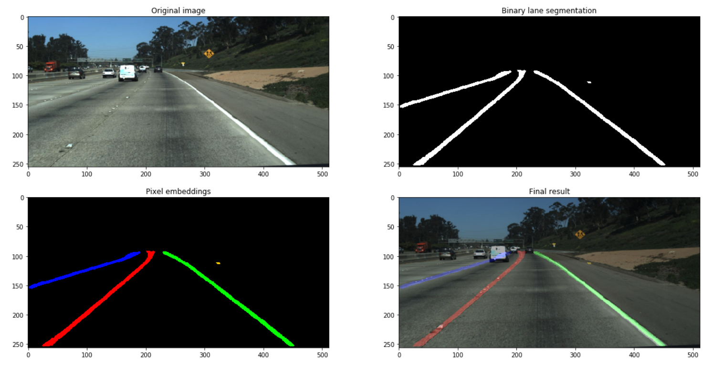

# ECBM6040-Project
This project is the student final project for Columbia University ECBM E6040 Neural Networks and Deep Learning Research. 
This project use PyTorch to implement the LaneNet given in the the paper "Towards End-to-End Lane Detection: an Instance
Segmentation Approach". LaneNet is trained end-to-end for lane detection, by treating lane detection as an instance 
segmentation problem. 

**Image from the original paper which shows the LaneNet architecture:**


**Image of the processing steps:**


___
## Table of Contents

- [Requirement](#Requirement)
- [Download and prepare the dataset](#Download-and-prepare-the-dataset)
- [Training the E-Net base LaneNet](#Training-the-E-Net-base-LaneNet)
- [Do evaluation on the test dataset](#Do-evaluation-on-the-test-dataset)
- [Generate some GIF to show the result](#Generate-some-GIF-to-show-the-result)
- [Reference](#Reference)
___
## Requirement
* Python 3.7
* [PyTorch 1.4.0](https://pytorch.org)
* [torchvision](https://pytorch.org/docs/stable/torchvision/index.html#torchvision)
* [sklearn 0.22.1](https://scikit-learn.org/stable/)
* [NumPy 1.18.2](https://numpy.org)

___
## Download and prepare the dataset
**Download:**

You should download the Lane Detection Challenge dataset from [TuSimple](https://github.com/TuSimple/tusimple-benchmark/issues/3)
dataset

1. Download ``train_set.zip`` and unzip to folder ``ECBM6040-Project/TUSIMPLE``
2. Download ``test_set.zip`` and unzip to folder ``ECBM6040-Project/TUSIMPLE`` 
3. Download ``test_label.json`` and put it into the folder ``ECBM6040-Project/TUSIMPLE/test_set`` which is unzipped form ``test_set.zip``

**Prepare:**

After you download the dataset from TuSimple dataset, some preprocess to the dataset should be done to prepare the dataset 
for training and testing.

1. Process the ``train_set`` split into ground truth image, binary ground truth and instance ground truth, you should run

```
python utils/process_training_dataset_2.py --src_dir (your train_set folder place)
for me this step is: python utils/process_training_dataset_2.py --src_dir /Users/smiffy/Documents/GitHub/ECBM6040-Project/TUSIMPLE/train_set
```

2. Then you can delete the folder ``ECBM6040-Project/TUSIMPLE/train_set`` and json files in ``ECBM6040-Project/TUSIMPLE/training``

3. You should see some folder like that in your ``train_set``
```
ECBM6040-Project
|---TUSIMPLE
.   |---Lanenet_output
.   |   |--lanenet_epoch_39_batch_8.model
.   |
.   |---training
.   |   |--lgt_binary_image
.   |   |--gt_image
.   |   |--gt_instance_image
.   |
.   |---txt_for_local
.   |   |--test.txt
.   |   |--train.txt
.   |   |--val.txt
.   |
.   |---test_set
.   |   |--clips
.   |   |--test_tasks_0627.json
.   |   |--test_label.json
.   |   |--readme.md
.   |
.   |---test_clips
```

***For the data prepare you can reference [LaneNet TensorFlow project](https://github.com/MaybeShewill-CV/lanenet-lane-detection) but there is some different.***
___
## Training the E-Net base LaneNet
1. Dataset for training: You can use ``ECBM6040-Project/Notebook-experiment/Dataset Show.ipynb`` to see the dataset for training
2. Use the ``ECBM6040-Project/Train.ipynb`` to train the LaneNet, the model will save in ``ECBM6040-Project/TUSIMPLE/Lanenet_output``
3. You can also train the LaneNet with augmented dataset by using ``ECBM6040-Project/Train_aug.ipynb``
___
## Do evaluation on the test dataset
The evaluation base on TuSimple challenge evaluation method you can get more information from [TuSimple exampe](https://github.com/TuSimple/tusimple-benchmark/blob/master/example/lane_demo.ipynb)
1. You can use the jupyter notebook ``ECBM6040-Project/Notebook-experiment/Evaluation of Lanenet.ipynb`` to see the evaluation result
2. The final evaluation result is like that:

|               | Accuracy |    FP   |    FN   |
|:--------------|:---------|:--------|:--------|
| Original Paper| 96.4%    | 7.80%   |  2.44%  |  
| My result     | 94.3%    | 14.70%  |  6.95%  |
| My result aug | 94.7%    | 15.08%  |  6.24%  |
3. The speed result is like that:

**Original Paper** : fps is 62.5 ``(one NVIDIA 1080 TI)``

|               | time (ms)|
|:--------------|:---------|
| Forward pass  | 12       |
| Clustering    | 4.6      |

**My Result** : fps is 20(forward), 1.6(clustering) ``(Google Cloud Platform and one  NVIDIA Tesla P100 GPU and clustering use CPU)``

|               | time (ms)|
|:--------------|:---------|
| Forward pass  | 50       |
| Clustering    | 619      |

___
## Generate some GIF to show the result

Use the ``ECBM6040-Project/Notebook-experiment/Generate Video and show the result.ipynb``, you can generate some gif to show the result on some clips in ``ECBM6040-Project/TUSIMPLE/test_clips`` and output gif will find in ``ECBM6040-Project/TUSIMPLE/gif_output``


___
## Reference
[1] Neven, D., De Brabandere, B., Georgoulis, S., Proesmans, M. and Van Gool, L., 2018, June. Towards end-to-end lane 
detection: an instance segmentation approach. In 2018 IEEE intelligent vehicles symposium (IV) (pp. 286-291). IEEE. 
https://arxiv.org/abs/1802.05591

[2] LaneNet TensorFlow project https://github.com/MaybeShewill-CV/lanenet-lane-detection

[3] TuSimple Dataset https://github.com/TuSimple/tusimple-benchmark

[4] E-Net Project https://github.com/davidtvs/PyTorch-ENet
